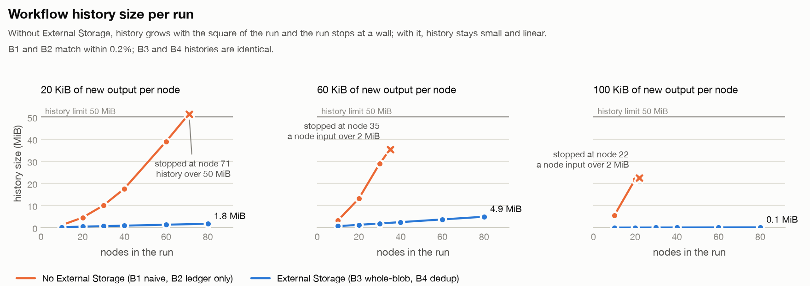
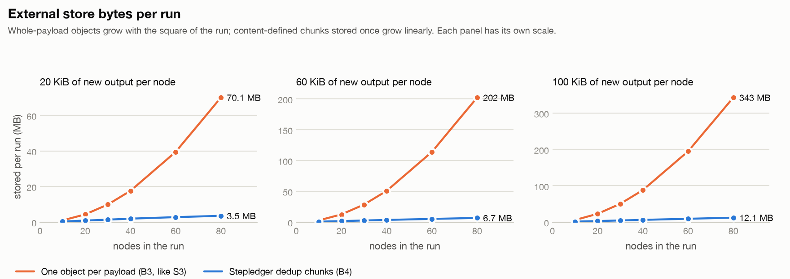

<!-- Generated by `uv run python -m bench.report` from bench/results/*.json. Edit bench/report.py, not this file. -->

# Stepledger

**Every LangGraph node running on Temporal, recorded once per Activity execution in your own Postgres, at any state size.**

Stepledger is one Temporal plugin that sits next to Temporal's `LangGraphPlugin`. It writes one fenced Postgres row per node Activity execution, commits it only once the workflow has accepted that result, and checks itself against Temporal's own history. Its deduplicating External Storage driver keeps accumulating agent state under Temporal's payload and history limits. It changes no graph code and does not modify the LangGraph plugin. It was built in response to [temporalio/sdk-python#1894](https://github.com/temporalio/sdk-python/issues/1894).

## The problem, measured

The LangGraph plugin sends each node's whole input state as its Activity input, and Temporal records every Activity input in history. For an agent whose state accumulates:

- **Persisting once at the end fails.** The final state is the first payload over the 2 MiB limit: the run gets stuck (SDK default) or the server terminates it (the #1894 error).
- **Writing each node's delta from its Activity moves the failure, it does not remove it.** At 60 KiB of new output per node the run still stops at node 35, because that node's own input crosses 2 MiB; history is already 35.42 MiB. With smaller outputs the 50 MiB history limit comes first.
- **Per-node writes are at-least-once.** Under injected crashes, a plain insert produced 17 duplicate and 13 divergent rows in 20 runs; an upsert still produced 5 divergent rows (a zombie attempt overwriting the accepted answer) and 4 duplicate side effects.
- **External Storage fixes history, but storage then grows with the square of the run:** one object per payload, and every node input is a slightly longer copy of the last.

## Install

```bash
pip install stepledger
```

Requires Python 3.11 or later, `temporalio[langgraph]` 1.33 or later, `langgraph` 1.2, and Postgres 16. For the local environment the tests and benches use (Postgres plus a Temporal dev server with explicit payload and history limits): `scripts/dev.sh up`.

## Integration

```python
from datetime import timedelta
import os
from temporalio.client import Client
from temporalio.contrib.langgraph import LangGraphPlugin
from temporalio.worker import Worker
from stepledger import StepledgerPlugin

lg = LangGraphPlugin(
    graphs={"investigate": build_graph()},
    default_activity_options={"start_to_close_timeout": timedelta(minutes=2)},
)
sl = StepledgerPlugin(dsn=os.environ["STEPLEDGER_DSN"], langgraph=lg)
client = await Client.connect("localhost:7233", plugins=[sl])
worker = Worker(client, task_queue="agents", workflows=[InvestigateWorkflow], plugins=[lg])
```

Then `stepledger init-db` once. Workers built from the client inherit the plugin.

## What beats it

| id | attack | measured | expected |
|---|---|---|---|
| 7.4 | Encrypted payloads | dedupe 11.0x plaintext vs 1.0x encrypted | dedupe is defeated (about 1x); the ledger stays correct; payloads counted as opaque |
| 7.6 | Effect whose tool ignores the key; crash before its record | direct: 3 duplicate tickets / 0 needed a person, once_blind: 0 duplicate tickets / 3 needed a person, once: 0 duplicate tickets / 0 needed a person | duplicates only without once(); blind once() stops for a person |
| 7.8 | Workflow reset (new run ID) | 6 duplicate effects across 3 resets | effects repeat unless the tool's own key dedupes |

- With the journal on, 17 billed model calls were still wasted: the worker died between the provider call and the journal write.
- With `on_ledger_error="warn"`, a database outage leaves rows missing until `stepledger reconcile` repairs them from history.
- History still grows, linearly; unbounded runs still need continue-as-new.

See [docs/limitations.md](docs/limitations.md) and [RESULTS.md](RESULTS.md).

## What it does, measured

- **One row per node Activity execution, fenced and committed against history.** Across 20 crash-injected runs (the worker killed at fault points F1 to F5, and zombie attempts writing late at F6), Stepledger had 0 duplicate, 0 divergent, 0 lost and 0 orphan rows, and 0 duplicate side effects, each checked against the result Temporal recorded.
- **Past the wall.** With the dedup driver the 40-node run that stops B1 completes; the largest payload left in history is 63.9 KB and history is 2.5 MiB.
- **Linear storage.** At 80 nodes x 100 KiB per node: 342.97 MB as one object per payload, 12.15 MB as dedup chunks (28.2x less).
- **The view equals the truth.** Over 100 seeded runs, `materialize()` rebuilt 80 runs EXACT and equal to the workflow's result, declared 20 gaps (workflow-side nodes, task-cache hits), and gave 0 wrong answers.
- **The retry bill.** With the LLM journal, money wasted on attempts Temporal did not accept fell from USD 1.452 to USD 0.204 (86% less) under the same seeded crash plan.
- **Small overhead.** Ledger write p95 6.109 ms; 1.387 ms of wall clock per node; about 101 bytes of history per node, constant as runs grow.

All numbers come from `bench/results/*.json` via the commands in [RESULTS.md](RESULTS.md).

## The five demos

Each runs with one command against the local dev environment (`scripts/dev.sh up && uv run stepledger init-db`):

```bash
uv run python bench/demo.py --demo cliff        # reproduce #1894, and get past it
uv run python bench/demo.py --demo chaos        # pull the plug
uv run python bench/demo.py --demo growth       # the quiet quadratic
uv run python bench/demo.py --demo materialize  # the view equals the truth
uv run python bench/demo.py --demo cost         # the retry bill
```

### Demo 1: the cliff

| config | nodes | SDK default | payload check disabled | largest payload (bytes) | history (MiB) | events |
|---|---|---|---|---|---|---|
| B0 bulk persist at end | 36 | STUCK at persist_all (PAYLOADS_TOO_LARGE) | TERMINATED at persist_all (BAD_SCHEDULE_ACTIVITY_ATTRIBUTES) | 2,067,993 | 39.37 | 218 |
| B1 naive per-node write | 40 | STUCK at node 35 (PAYLOADS_TOO_LARGE) | TERMINATED at node 35 (BAD_SCHEDULE_ACTIVITY_ATTRIBUTES) | 2,067,894 | 35.42 | 206 |
| B2 stepledger (no ext storage) | 40 | STUCK at node 35 (PAYLOADS_TOO_LARGE) | TERMINATED at node 35 (BAD_SCHEDULE_ACTIVITY_ATTRIBUTES) | 2,067,894 | 35.43 | 206 |
| B3 stepledger + whole-blob storage | 40 | COMPLETED | COMPLETED | 63,872 | 2.50 | 250 |
| B4 stepledger + dedup storage | 40 | COMPLETED | COMPLETED | 63,873 | 2.50 | 250 |

### Demo 2: pull the plug

| config | runs | faults injected | duplicate rows | divergent rows | lost rows | orphan rows | duplicate side effects |
|---|---|---|---|---|---|---|---|
| B1 naive per-node write | 20 | 20 | 17 | 13 | 0 | 0 | 7 |
| B1u naive upsert | 20 | 20 | 0 | 5 | 0 | 0 | 4 |
| Stepledger | 20 | 20 | 0 | 0 | 0 | 0 | 0 |

### Demo 3: the quiet quadratic

<picture>
  <source media="(prefers-color-scheme: dark)" srcset="bench/plots/history-dark.png">
  
</picture>

<picture>
  <source media="(prefers-color-scheme: dark)" srcset="bench/plots/storage-dark.png">
  
</picture>

## What this is not

- Not a LangGraph checkpointer, and not a replacement for Temporal's durability: Temporal stays the source of truth and the ledger is a projection of it.
- Not exactly-once for external effects: `once()` is at-least-once delivery with dedupe, and an unknown outcome stops for a person.
- Not a hosted service, a UI, or a new agent framework.

## Docs

- [How it works](docs/how-it-works.md): one step's life, commits, seal, reconcile, the read side
- [Keys and fencing](docs/keys-and-fencing.md)
- [Storage and GC](docs/storage-and-gc.md)
- [Effects, the LLM journal and the retry bill](docs/effects.md)
- [Limitations](docs/limitations.md)
- [SDK facts](docs/sdk-facts.md): every SDK behavior relied on, with file and line

## Prior art, and where each stops

- **Temporal's LangGraph plugin** (`temporalio.contrib.langgraph`) runs nodes as Activities and caches task results across continue-as-new. It keeps no per-node record outside Temporal. Stepledger composes with it and never modifies it.
- **LangGraph checkpointers** (`PostgresSaver`) persist each superstep in-process; behind the Activity boundary they are bypassed.
- **Temporal External Storage and its S3 driver** are the claim-check pattern built into the SDK. The driver stores one object per payload; Stepledger adds a deduplicating Postgres driver and does not replace the mechanism.
- **DataDog's `temporal-large-payload-codec`** does claim-check as a codec plus a service, whole-blob.
- **Temporal's idempotency guidance** (key on the run ID plus the Activity ID) is guidance, not a mechanism; it does not cover divergent retries, zombies or commit visibility.
- **Fencing tokens** (Martin Kleppmann, "How to do distributed locking") are the idea behind the attempt fence.
- **The transactional outbox** is the pattern behind committing on the next node's transaction.
- **FastCDC** (Xia et al., USENIX ATC 2016), as used by restic and borg, through the `fastcdc` Python package.
- **SpecuNode**, the author's earlier project, for journal-before-use and idempotency keys for agent effects.

## License

Apache-2.0.
